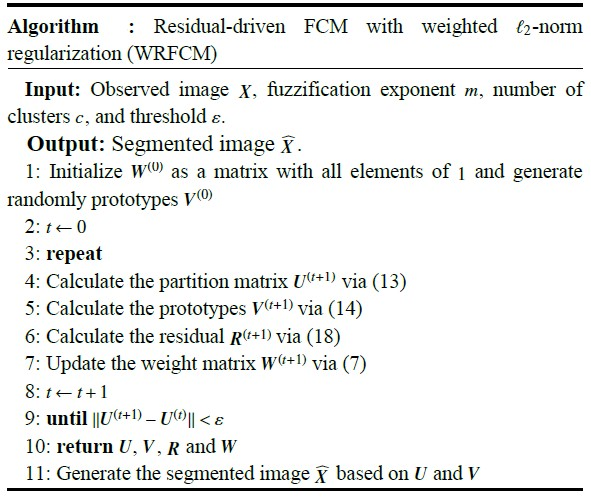

# Residual-driven-Fuzzy-C-Means-Clustering-for-Image-Segmentation
This project focuses on implementing the <a href="https://ieeexplore.ieee.org/document/9242330">Residual-driven Fuzzy C-Means Clustering for Image Segmentation</a> algorithm in Python. The repository provides a brief overview of the algorithm steps and dives into the implementation and the results.

It is carried out as part of the 'Modélisation des systèmes de vision' module in the Master 2 Vision et Machine Intelligente program at the University of Paris Cité.

By : Yidhir Aghiles KOULAL <br>
Professor: Mr Camille KURTZ<br>
Supervisor of the topic: Mr Laurent WENDLING<br>
#### Table of contents
1. [Overview](#overview)
2. [Algorithm](#algorithm)
3. [Parameters](#parameters)
4. [Key Features](#key-features)
5. [Usage](#usage)
6. [Results](#results)
7. [Citation](#citation)
8. [Contribution](#contribution)

## Overview
This project implements the Residual-driven Fuzzy C-Means (RFCM) algorithm for color image segmentation based on the work by Cong Wang, Witold Pedrycz, ZhiWu Li, and MengChu Zhou <a href="https://ieeexplore.ieee.org/document/9242330">[link]</a>. RFCM addresses the limitations of traditional Fuzzy C-Means (FCM) by incorporating a residual-related regularization term to precisely estimate noise, enhancing clustering performance.

The main idea is to integrate a residue-driven regularization term into the <a href= "https://www.tandfonline.com/doi/abs/10.1080/01969727308546046">FCM</a> algorithm to accurately estimate noise and improve clustering performance.

The authors propose a framework that integrates spatial information and introduces a weighted regularization term to handle mixed or unknown noise, to enable more accurate noise estimation and the use of a noise-free image in the clustering process for improved results.

The algorithm, called WRFCM, is designed to balance the effectiveness and efficiency of clustering and improve existing FCM variants by considering accurate noise estimation.

The effectiveness of WRFCM is demonstrated by experiments on synthetic, medical, and real images, showing superior segmentation results to those of other FCM variants.

The algorithm enables accurate estimation of residuals (noise) and can be run with low computational overhead.

Finally, this approach contributes to improving the performance of image segmentation in the presence of mixed or unknown noise.

## Algorithm
<p align="center">
  
</p>

The algorithm iteratively updates membership degrees, calculates cluster centers, residual matrix, and updates weights until convergence, effectively segmenting the image.

The mathematical formulas are as follows :

* (13)
$u_{ij}(t+1) = \frac{\left(\sum_{n \in N_j} \frac{\|x_n - r_n(t) - v_i(t)\|^2}{1 + d_{nj}}\right)^{-\frac{1}{m-1}}}{\sum_{q=1}^c \left(\sum_{n \in N_j} \frac{\|x_n - r_n(t) - v_q(t)\|^2}{1 + d_{nj}}\right)^{-\frac{1}{m-1}}}$

* (14)
$v_{ij}^{(t+1)} = \frac{\sum_{j=1}^K \left( \left( u_{ij}^{(t+1)} \right)^m \sum_{n \in N_j} \frac{x_n - r_n^{(t)}}{1 + d_{nj}} \right)}{\sum_{j=1}^K \left( \left( u_{ij}^{(t+1)} \right)^m \sum_{n \in N_j} \frac{1}{1 + d_{nj}} \right)}$


* (7)
$w_{jl} = e^{-\xi r^2_{jl}}$

## Parameters
* U : Fuzzy membership matrix where $u_{ij}$ represents the degree of membership of data point $x_j$ to cluster i.

* V : Matrix containing the cluster centroids $v_i$

* R : residual (noise)

* W : weight matrix

* β : parameter controls the impact of the fidelity term

* ||.|| : Euclidiean distance

* K : Number of points

* C : Number of Clusters
  
* m : parameter to control the fuzziness of the clustering

* n : local window of size

* $\xi$ : a positive parameter, which aims to control the decreasing rate of W


## Key Features
* **Residual-driven Approach :**  Integration of a residual-related fidelity term for accurate noise estimation.

* **Spatial Information Integration :** Framework incorporating spatial information for improved segmentation.

* **Weighted Regularization Term:** Introduction of a weighted -norm regularization term to handle mixed or unknown noise.

* **Low Computational Overhead:** Efficient execution with minimal computational burden.

* **Enhanced Segmentation in Noisy Environments:** Contribution to improved image segmentation in the presence of mixed or unknown noise.

## Usage
Clone the repository: 
```
$ git clone https://github.com/Y1D1R/Residual-driven-Fuzzy-C-Means-Clustering-for-Image-Segmentation.git
``` 

Run the main script: 
``` 
$ python main.py 
```

## Results and Evaluation
The initial step in the evaluation process of our segmentation algorithm involves computing the confusion matrix.

A confusion matrix is a table that summarizes the performance of a classification model by comparing its predicted labels to the true labels. It displays the number of true positives (TP), true negatives (TN), false positives (FP), and false negatives (FN) of the algorithm's predictions of clusters.

In our case, the size of the Confusion Matrix will be (C * C) with C >= 2

Then we we adopt three objective evaluation indicators:

**Segmentation Accuracy (SA):** Segmentation Accuracy measures the proportion of correctly classified pixels in the segmented image compared to a reference or ground truth segmentation. It is calculated by dividing the number of correctly classified pixels by the total number of pixels in the image. <br>
SA provides an overall measure of how accurately the algorithm segments the image, with higher values indicating better segmentation performance.

**Matthews Correlation Coefficient (MCC):** The Matthews Correlation Coefficient is a measure of the quality of binary classifications, such as segmentation. It takes into account true positives, true negatives, false positives, and false negatives.<br>
MCC considers the balance between sensitivity (the ability to correctly detect positive instances) and specificity (the ability to correctly identify negative instances). <br>
The MCC value ranges from -1 to 1, where 1 represents a perfect segmentation, 0 indicates random segmentation, and -1 suggests complete disagreement between the segmentation and the ground truth.

**Sorensen-Dice Similarity (SDS):** The Sorensen-Dice Similarity, also known as the Dice coefficient, is a similarity measure commonly used in image segmentation evaluation. <br>It quantifies the similarity between the segmented region and the ground truth region. 
<br>The SDS is calculated by dividing twice the number of overlapping pixels by the sum of the pixels in both regions. It ranges from 0 to 1, where 1 represents a perfect overlap between the segmented region and the ground truth, and 0 indicates no overlap.


## Citation
If you use this code, please cite the original paper:

Cong Wang, Witold Pedrycz, ZhiWu Li & MengChu Zhou. “Residual-driven Fuzzy C-Means Clustering for Image Segmentation”. en. In : IEEE/CAA JOURNAL OF AUTOMATICA SINICA. 8 (2021), p. 876-889.

## Contribution
Feel free to contribute by opening issues or submitting pull requests.
