# Residual-driven-Fuzzy-C-Means-Clustering-for-Image-Segmentation
This project focuses on implementing the <a href="https://ieeexplore.ieee.org/document/9242330">Residual-driven Fuzzy C-Means Clustering for Image Segmentation</a> algorithm in Python. The repository provides a brief overview of the algorithm steps and dives into the implementation and the results.

It is carried out as part of the 'Modélisation des systèmes de vision' module in the Master 2 Vision et Machine Intelligente program at the University of Paris Cité.

By : Yidhir Aghiles KOULAL <br>
Supervisor of the topic: Mr Laurent WENDLING<br>
Professor: Mr Camille KURTZ<br>
#### Table of contents
1. [Overview](#overview)
2. [Algorithm](#algorithm)
3. [Parameters](#parameters)
4. [Key Features](#key-features)
5. [Usage](#usage)
6. [Results](#results-and-evaluation)
7. [Improvement](#improvement)
8. [Limitations](#limitations)
9. [Citation](#citation)


## Overview
This project implements the Residual-driven Fuzzy C-Means (RFCM) algorithm for color image segmentation based on the work by Cong Wang, Witold Pedrycz, ZhiWu Li, and MengChu Zhou <a href="https://ieeexplore.ieee.org/document/9242330">[link]</a>. RFCM addresses the limitations of traditional Fuzzy C-Means (FCM) by incorporating a residual-related regularization term to precisely estimate noise, enhancing clustering performance.

The main idea is to integrate a residue-driven regularization term into the <a href= "https://www.tandfonline.com/doi/abs/10.1080/01969727308546046">FCM</a> algorithm to accurately estimate noise and improve clustering performance.

The authors propose a framework that integrates spatial information and introduces a weighted regularization term to handle mixed or unknown noise, to enable more accurate noise estimation and the use of a noise-free image in the clustering process for improved results.

The algorithm, called WRFCM, is designed to balance the effectiveness and efficiency of clustering and improve existing FCM variants by considering accurate noise estimation.

The effectiveness of WRFCM is demonstrated by experiments on synthetic, medical, and real images, showing superior segmentation results to those of other FCM variants.

The algorithm enables accurate estimation of residuals (noise) and can be run with low computational overhead.

Finally, this approach contributes to improving the performance of image segmentation in the presence of mixed or unknown noise.

## Algorithm
<p align="center">
  
</p>

The algorithm iteratively updates membership degrees, calculates cluster centers, residual matrix, and updates weights until convergence, effectively segmenting the image.

The mathematical formulas are as follows :

* (13)
$u_{ij}(t+1) = \frac{\left(\sum_{n \in N_j} \frac{\|x_n - r_n(t) - v_i(t)\|^2}{1 + d_{nj}}\right)^{-\frac{1}{m-1}}}{\sum_{q=1}^c \left(\sum_{n \in N_j} \frac{\|x_n - r_n(t) - v_q(t)\|^2}{1 + d_{nj}}\right)^{-\frac{1}{m-1}}}$

* (14)
$v_{ij}^{(t+1)} = \frac{\sum_{j=1}^K \left( \left( u_{ij}^{(t+1)} \right)^m \sum_{n \in N_j} \frac{x_n - r_n^{(t)}}{1 + d_{nj}} \right)}{\sum_{j=1}^K \left( \left( u_{ij}^{(t+1)} \right)^m \sum_{n \in N_j} \frac{1}{1 + d_{nj}} \right)}$


* (7)
$w_{jl} = e^{-\xi r^2_{jl}}$

## Parameters
* **U : Fuzzy membership matrix** <br>
Each element $u_{ij}$ in the matrix represents the likelihood or degree of membership of data point $x_j$ to cluster i. The values of U range between 0 and 1, where higher values indicate a stronger membership.

* **V : cluster centroids Matrix** <br>
Each row corresponds to the centroid coordinates of a cluster. The centroids represent the representative or central points of the clusters and are updated iteratively during the algorithm's execution.

* **R : residual matrix (noise)** <br>
It represents the unexplained variation in the data after clustering, and It is computed as the difference between the original data matrix $X$ and the reconstructed data matrix  $\hat{X}$ (noise-free Image), where  $\hat{X}$ is obtained by subtracting the noise matrix R from $X$.
<br>The noise matrix captures the parts of the data that do not fit well into the clusters.

* **W : weight matrix** <br>
It determines the importance of each residual to form a weighted residual that obeys a Gaussian distribution.

* **β : parameter controls the impact of the fidelity term**<br>
It determines the trade-off between fitting the data accurately (fidelity) and achieving a smooth clustering solution (regularization). A higher value of β emphasizes the fidelity term, while a lower value emphasizes the regularization term.

* **||.|| : Euclidiean distance** <br>
It is commonly used in clustering algorithms to calculate the similarity or proximity between points.

* **K : Number of points**
<br> It represents the total number of data points in the image
 
* **C : Number of Clusters**<br>
Choosing the appropriate value for C depends on the complexity of the image and the specific segmentation task.
  
* **m : degree of fuzziness**
It is an exponent that determines the "diffusivity" of the membership degrees. A higher value of m makes the membership degrees more discriminative, while a lower value makes them more diffuse.<br>
A common value for m is usually between 2 and 5.

* **n : local window of size** <br>
It is used in certain algorithms to define the proximity or influence of neighboring points on the clustering process.

* **$\xi$ : a positive parameter, which aims to control the decreasing rate of W**<br>
It is used to influence the importance of regularization during the update of the W weights. A higher gives more weight to regularization, which can help suppress noise and achieve sharper boundaries.

* **$\epsilon$ : The threshold determines the convergence criterion for the algorithm**<br>
The idea behind this stopping criterion is that when the updates to the membership matrix **U** become negligible between iterations, it indicates that the clusters have stabilized and the members of the clusters are not changing significantly. At this point, it is considered that the algorithm has converged and can stop.


## Key Features
* **Residual-driven Approach :**  Integration of a residual-related fidelity term for accurate noise estimation.

* **Spatial Information Integration :** Framework incorporating spatial information for improved segmentation.

* **Weighted Regularization Term:** Introduction of a weighted -norm regularization term to handle mixed or unknown noise.

* **Enhanced Segmentation in Noisy Environments:** Contribution to improved image segmentation in the presence of mixed or unknown noise.

## Usage
Clone the repository: 
```
$ git clone https://github.com/Y1D1R/Residual-driven-Fuzzy-C-Means-Clustering-for-Image-Segmentation.git
``` 

Befor runing the main script, you must change the path of your image: 
``` 
$ python wrfcm.py 
```

You can also use the Google Colab notebook.

## Results and Evaluation
The initial step in the evaluation process of our segmentation algorithm involves computing the confusion matrix.

A confusion matrix is a table that summarizes the performance of a classification model by comparing its predicted labels to the true labels. It displays the number of true positives (TP), true negatives (TN), false positives (FP), and false negatives (FN) of the algorithm's predictions of clusters.

In our case, the size of the Confusion Matrix will be (C * C) with C >= 2

Then we we adopt three objective evaluation indicators:

**Segmentation Accuracy (SA):** Segmentation Accuracy measures the proportion of correctly classified pixels in the segmented image compared to a reference or ground truth segmentation. It is calculated by dividing the number of correctly classified pixels by the total number of pixels in the image. <br>
SA provides an overall measure of how accurately the algorithm segments the image, with higher values indicating better segmentation performance.

**Matthews Correlation Coefficient (MCC):** The Matthews Correlation Coefficient is a measure of the quality of binary classifications, such as segmentation. It takes into account true positives, true negatives, false positives, and false negatives.<br>
MCC considers the balance between sensitivity (the ability to correctly detect positive instances) and specificity (the ability to correctly identify negative instances). <br>
The MCC value ranges from -1 to 1, where 1 represents a perfect segmentation, 0 indicates random segmentation, and -1 suggests complete disagreement between the segmentation and the ground truth.


**Sorensen-Dice Similarity (SDS):** The Sorensen-Dice Similarity, also known as the Dice coefficient, is a similarity measure commonly used in image segmentation evaluation. <br>It quantifies the similarity between the segmented region and the ground truth region. 
<br>The SDS is calculated by dividing twice the number of overlapping pixels by the sum of the pixels in both regions. It ranges from 0 to 1, where 1 represents a perfect overlap between the segmented region and the ground truth, and 0 indicates no overlap.

The tests were conducted on various types of images, including :
<HR>


* **Medical images** ( <a href="http://www.bic.mni.mcgill.ca/brainweb/">BrainWeb : Simulated Brain Database</a> )
<br><p align="center">
  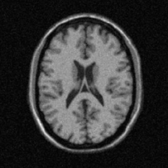
  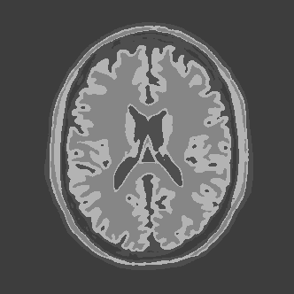
  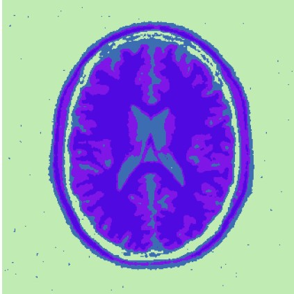
</p>
MRI image, Ground Truth and WRFCM result.

| Algorithm  | SA | SDS | MCC | Clusters|
| ------------- | ------------- | ------------- |------------- |------------- |
| Original WRFCM | 82.317 | 98.966 | 98.147 | 4 |
| Implemented WRFCM | 95.993  | 87.806  | 85.103 | 4 |

For convergence analysis, we draw the curve of $\theta = || U^{(t+1)} - U^{(t)} ||$ 

<br><p align="center">
  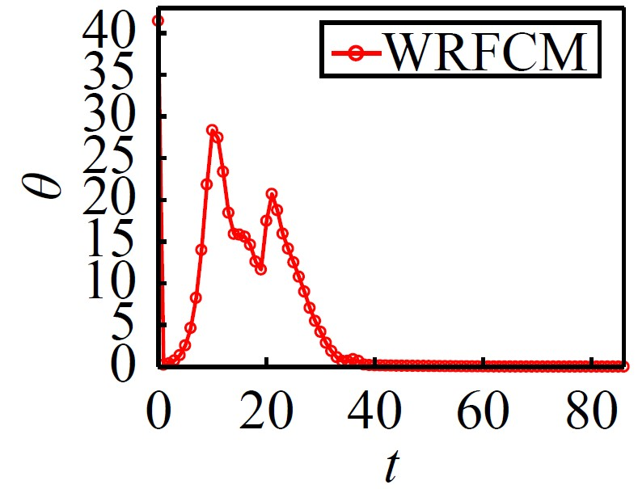
  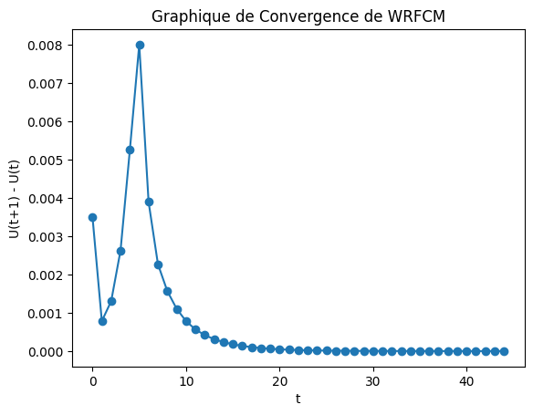
</p>

The oscillation in $\theta$ is observed due to the random initialization of the prototypes.
<HR>

* **Synthetic images**

<p align="center">
  
  
  
</p>

Synthetic image with noise, Ground Truth and WRFCM result.

| Algorithm  | SA | SDS | MCC |
| ------------- | ------------- | ------------- |------------- |
| Original WRFCM | 99.859 |99.937| 99.843 |
| Implemented WRFCM | 99.85  | 99.70  | 99.60 |
<HR>

* **Real-World images** 
<br>(<a href="https://neo.gsfc.nasa.gov/dataset_index.php">Nasa Earth Observation, NASA Earth Observation Database (NEO)</a>) 
<p align="center">
  
  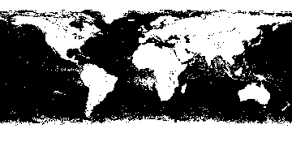
  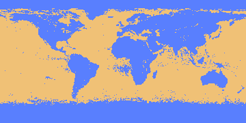
</p>

Nasa Earth Observation image with 2 clusters, Ground Truth and WRFCM result.

| Algorithm  | SA | SDS | MCC |
| ------------- | ------------- | ------------- |------------- |
| Original WRFCM | 99.881 | 98.797 | 97.582 |
| Implemented WRFCM | 99.9  | 99.5  | 99.07 |

<p align="center">
  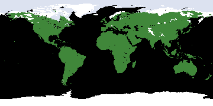
  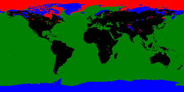
  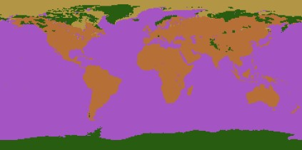
</p>

Nasa Earth Observation image with 4 clusters, Ground Truth and WRFCM result.

| Algorithm  | SA | SDS | MCC |
| ------------- | ------------- | ------------- |------------- |
| Original WRFCM | 99.08 | 99.149 | 98.512 |
| Implemented WRFCM | 99.92  | 99.68  | 99.64 |


<br>(<a href="https://www2.eecs.berkeley.edu/Research/Projects/CS/vision/bsds/">The Berkeley Segmentation Dataset (BSDS)</a> )
<br><p align="center">
  
  
  
</p>
BSDS image, Ground Truth and WRFCM result.

| Algorithm  | SA | SDS | MCC | 
| ------------- | ------------- | ------------- |------------- |
| Original WRFCM | 98.732 | 98.162 | 97.201 | 
| Implemented WRFCM |87.361 | 89.457  |  76.361 | 

## Improvement
To decrease execution time and prevent the random initialization of prototypes, which leads to unnecessary iterations, I am considering employing k-means to obtain cluster centers at the beginning of the algorithm.

Instead of randomly initializing the centroid matrix V, we employ the K-means algorithm for the initialization. The results were remarkable: a significant reduction in the number of iterations and, consequently, the execution time.

<br><p align="center">
  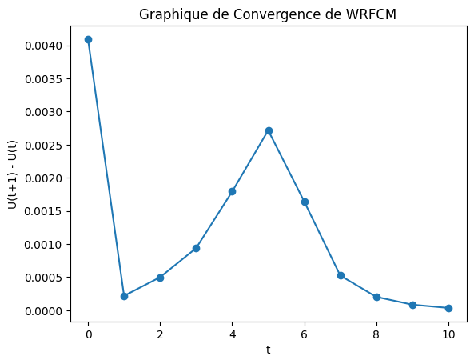
  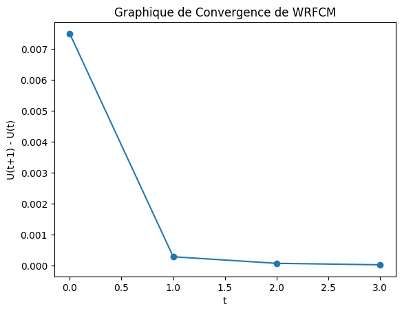
</p>

The reduction in iteration count and execution time is particularly noteworthy, showcasing the effectiveness of this initialization strategy in optimizing the clustering process.

## Limitations
While **WRFCM** is a useful algorithm for image segmentation, it also has some limitations:

#### Selection of parameters:
WRFCM requires the selection of various parameters, such as the number of clusters and fuzziness parameter. Choosing appropriate values for these parameters can be challenging and may require domain expertise.

#### Computational complexity: 
WRFCM involves iterative computations, which can be computationally expensive. As the number of data points and clusters increases, the algorithm's execution time may become a limiting factor.


## Citation
If you use this code, please cite the original paper:

Cong Wang, Witold Pedrycz, ZhiWu Li & MengChu Zhou. “Residual-driven Fuzzy C-Means Clustering for Image Segmentation”. en. In : IEEE/CAA JOURNAL OF AUTOMATICA SINICA. 8 (2021), p. 876-889.


